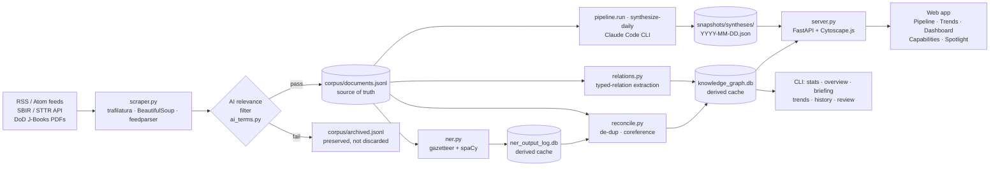

# AI Landscape

An accurate, navigable **knowledge graph of the AI national-security
landscape**, built by scraping defense and AI news, extracting entities and
relationships, and reconciling them into a graph you can explore in a
browser.

## How it works



The flow in plain English: feeds + awards + budget books → AI-filtered
into the corpus → NER + reconcile + typed-relation extraction → SQLite
knowledge graph → served as JSON to a Cytoscape browser UI. The corpus
is the only piece you have to keep; everything else regenerates from it.

**Data sources.** Three kinds feed the corpus:

  * **News feeds** (RSS/Atom) — roughly 2:1 defense-to-public. General
    feeds (Atlantic Council, ASPI Strategist, Just Security, etc.) are
    AI-filtered per article so the corpus stays scoped. AI-curated
    feeds (MIT News - AI, IEEE Spectrum - AI, OpenAI, DeepMind, etc.)
    bypass the filter — the publisher already curated.
  * **SBIR/STTR award records** from the SBIR.gov public API — awarded
    contracts are a concrete primary source for where defense AI
    funding goes. Awards are filtered to AI-related ones locally via
    the shared `ai_terms.py` lexicon.
  * **DoD Justification Books** (FY26 / FY27 PDFs) — AI-relevant R&D
    program elements extracted via `pypdf` and the same AI filter.

**The corpus is the source of truth.** `corpus/documents.jsonl` is an
append-only, committed file of scraped documents. Both SQLite databases
(`data/ner_output_log.db`, `data/knowledge_graph.db`) are *derived caches* —
`rebuild` regenerates them deterministically, so the graph is always
reproducible from version-controlled text.

`corpus/archived.jsonl` is a sidecar archive: docs pruned out of the
active corpus by `audit-corpus-ai --prune` land here instead of being
discarded. If the AI filter changes you can run `audit-corpus-ai
--reinstate` to pull qualifying docs back, no re-scraping required.

## Setup

Requires **Python 3.9+**.

```
pip install -r requirements.txt
```

`spaCy` is optional but recommended — it powers the default `hybrid` NER
backend (gazetteer + statistical model). Without it the pipeline falls back
to the rule-based backend automatically.

```
pip install "spacy<3.8"            # 3.8+ needs Python 3.10+
python -m spacy download en_core_web_sm
```

## Usage

The CLI is the front door for ingest, rebuild, audit, and serving. Every
subcommand takes `--help` for full options.

### Ingest + rebuild

```
python -m ailandscape.cli run                scrape feeds + SBIR + J-Books, then rebuild
python -m ailandscape.cli rebuild            rebuild databases from the corpus (deterministic)
python -m ailandscape.cli sbir               pull AI-related SBIR/STTR awards, then rebuild
python -m ailandscape.cli jbooks             pull AI-related R&D items from DoD J-Books
python -m ailandscape.cli backfill           re-fetch corpus docs that stored only a teaser
python -m ailandscape.cli enrich plan.json   fetch articles + Claude synthesis for an entity
python -m ailandscape.cli demo               run the flow on the bundled sample feed
```

### Corpus + filter management

```
python -m ailandscape.cli audit-corpus-ai            audit-only: counts of off-topic docs
python -m ailandscape.cli audit-corpus-ai --prune    move non-AI docs to corpus/archived.jsonl
python -m ailandscape.cli audit-corpus-ai --reinstate re-evaluate the archive; recover passers
python -m ailandscape.cli discover-feeds              probe new AI/nat-sec RSS feeds
python -m ailandscape.cli discover-feeds --health-check  verify existing feeds.FEEDS still parse
```

### Reports + history

```
python -m ailandscape.cli stats                  quick corpus + database counts
python -m ailandscape.cli overview               full statistical overview
python -m ailandscape.cli overview --diff        KPI deltas between the last two runs
python -m ailandscape.cli history [--limit 20]   per-run ingest history (timing, counts, errors)
python -m ailandscape.cli history --full         + per-feed scorecard
python -m ailandscape.cli briefing [--narrative] generated landscape briefing (optional LLM)
python -m ailandscape.cli trends                 temporal trends (document volume, new entities)
python -m ailandscape.cli reading [--list-stale] Claude-read coverage of the corpus
python -m ailandscape.cli review                 accumulate merge/ignore findings in review.json
```

### Trust + understanding

```
python -m ailandscape.cli explain                       system overview: modules, CLI verbs, API endpoints, test counts
python -m ailandscape.cli explain <module>              deep-dive: deps, reverse deps, tests, trust signals, last commit
python -m ailandscape.cli explain <module> --narrative  + Claude-written prose explanation (needs Claude Code or API key)
```

`explain` AST-walks the codebase to produce a deterministic structural
report — no LLM in the loop unless you pass `--narrative`. Useful when
you want to trust the wiring is what you think it is: which CLI verbs
touch a module, which tests cover it, when it was last committed, and
whether it has any TODO/FIXME markers.

### Snapshots + LLM syntheses

```
python -m ailandscape.cli synthesize-daily            generate today's hype + briefing snapshot
python -m ailandscape.cli synthesize-daily --force    regenerate even if today's snapshot exists
python -m ailandscape.cli snapshot                    export corpus + DBs to snapshots/
python -m ailandscape.cli digest [--preview]          send (or preview) the daily email digest
```

### Web app + visualization

```
python -m ailandscape.cli serve [--port 8137]   FastAPI + Cytoscape.js (default: 8000)
python -m ailandscape.cli visualize             export a static interactive HTML graph
```

The launch config in `.claude/launch.json` uses port **8137** so it
doesn't collide with the FastAPI default of 8000.

### Corrections + reset

```
python -m ailandscape.cli correct merge "DoD" "Department of Defense"
python -m ailandscape.cli correct ignore "Website Keywords"
python -m ailandscape.cli correct-from-review --merges --ignores --acronyms
python -m ailandscape.cli reset --confirm       delete derived DBs (corpus is preserved)
```

### Web app modals

`serve` starts a FastAPI backend + Cytoscape.js frontend. The backend
queries and subsets the full graph; the browser only ever renders a
focused slice, so it stays smooth.

Topbar buttons:

  * **Today's spotlight** — Claude-written hype read, served from the
    sidecar snapshot (zero API calls per visitor)
  * **Today's briefing** — generated landscape briefing + analyst
    narrative (also cache-first)
  * **Capabilities** — drill into a subfield (foundation models,
    autonomy, EW, ...)
  * **Trends** — document volume over time, new entities, spikes
  * **Trajectory** — many-months-at-a-glance entity activity
  * **Pipeline** — per-run ingest history with timing, counts,
    broken-feed callouts (sourced from `snapshots/run-history.jsonl`)
  * **Dashboard** — overall statistical overview

Sidebar (first view kept minimal): the **Search** box and **entity-type
filter** are always visible. The **Track** (what changed / connection /
overview) and **Tools** (advanced filters / legend) groups collapse by
default and open with one click.

## Manual corrections

`corrections.json` (`{"merge": {...}, "ignore": [...]}`) is consumed by
reconcile. It is version-controlled, so corrections persist and the graph
can still be reconstructed deterministically from corpus + corrections.

## Automation

`scripts/daily_scrape.ps1` runs `run` and commits the corpus + sidecar
snapshot + run-history line. It is wired to a Windows Task Scheduler job
that fires daily at 19:00 ET. The job is configured with
`StartWhenAvailable=True` so a missed tick (machine off / signed out)
fires when the user next logs in.

Synthesis (the "Today's spotlight" hype text + briefing narrative) is
generated by the Claude Code CLI under the user's Max subscription —
no separate API key needed. A keyless visitor still sees the synthesis
because the server reads it from the sidecar snapshot.

## Run via Docker

A prebuilt image is published to GitHub Container Registry on every
push to `main`:

```
docker pull ghcr.io/mattgrimm95/ai_landscape:latest
docker run --rm -p 8000:8000 ghcr.io/mattgrimm95/ai_landscape:latest
# open http://localhost:8000
```

Or, locally with the source tree (Dockerfile + docker-compose.yml in
the repo root):

```
docker compose build
docker compose up
```

Compose bind-mounts `./data` so the derived SQLite DBs persist across
container restarts. Pass `ANTHROPIC_API_KEY` from the host env (or a
gitignored `.env`) to enable live synthesis regeneration inside the
container; without it, the cache-first endpoints still serve the
committed snapshots in `snapshots/syntheses/`.

## Testing

```
python -m unittest discover -s tests -t .
```

Runs ~309 tests in ~10 seconds. CI runs:

  * `.github/workflows/tests.yml` — full unittest suite on push + PR,
    matrix Python 3.9 / 3.11 / 3.12, no-secrets guard runs first.
  * `.github/workflows/docker.yml` — `docker build` verifies the image
    on every push + PR; on push to `main` it also pushes
    `ghcr.io/mattgrimm95/ai_landscape:latest` and a `sha-<short>` tag.

`LLM_INDEX.md` is regenerated by the daily cron (`scripts/daily_scrape.ps1`
runs `python scripts/build_llm_index.py` before committing), so the
autogen index stays in sync with the latest public function
signatures without anyone having to remember to refresh it.

## Decisions + plan

  * `DECISIONS_LOG.md` records architecture choices and notable changes.
  * `skills_plan.md` and `TODO.txt` track design paradigms and future work
    (most recent at the top).
  * `LLM_INDEX.md` is an autogenerated index of public functions per
    module — read it (or have an LLM read it) to navigate the codebase
    without grep.
